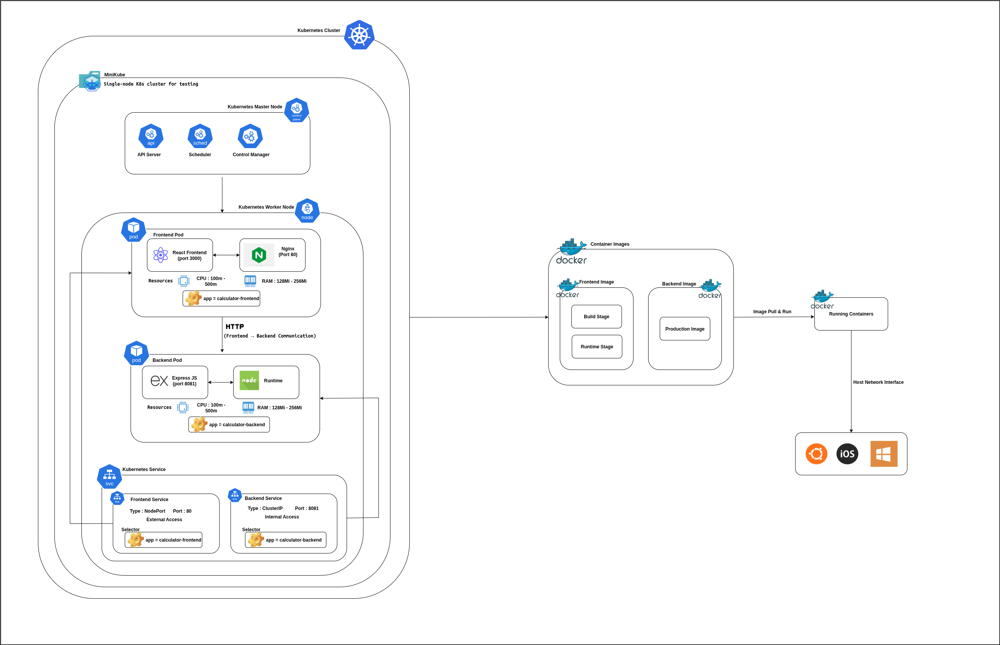

# Calculator App - Kubernetes-Ready Microservices

[](https://github.com/DharshanSR/calculator-k8s/releases)
[](https://nodejs.org/)
[](https://reactjs.org/)
[](https://expressjs.com/)
[](https://www.docker.com/)
[](https://kubernetes.io/)
[](LICENSE)

A modern, cloud-native calculator application built with microservices architecture, featuring a React frontend and Express.js backend, fully containerized and Kubernetes-ready for scalable deployment.

**Current Version: v1.1.0** - Enhanced release with improved UI, health checks, and version tracking.

## Quick Start

🚀 **Deploy in 3 simple steps:**

```bash
# 1. Start Minikube (if not running)
minikube start

# 2. Run the automated deployment script
./deploy.sh

# 3. Access the application
kubectl port-forward service/calculator-frontend 8080:80
# Open http://localhost:8080 in your browser
```

**Alternative manual deployment:**
```bash
# Configure Docker environment
eval $(minikube docker-env)

# Build and deploy
docker build -t calculator-backend:v1.1.0 ./backend
docker build -t calculator-frontend:v1.1.0 ./frontend
kubectl apply -f k8s/
```

## Architecture Overview

This application follows a **microservices architecture** pattern with clean separation of concerns, designed for cloud-native deployment using Docker containers orchestrated by Kubernetes. The architecture supports both local development and production deployment scenarios.

### Complete System Architecture



### Architecture Components Explained

This section provides a detailed breakdown of each component in the architecture diagram above, explaining their roles, ports, connections, and how they work together.

---

#### **🎯 Kubernetes Cluster Layer**

**Purpose**: Container orchestration platform that automates deployment, scaling, and management of containerized applications.

##### **Minikube (Local Development Environment)**
- **What it is**: Single-node Kubernetes cluster that runs locally on your machine
- **Purpose**: Provides a lightweight K8s environment for development and testing
- **Resource Allocation**: Typically 2 CPUs, 4GB RAM for this application
- **Network**: Creates a virtual network isolated from your host machine

##### **Kubernetes Master Node (Control Plane)**
The brain of the Kubernetes cluster that makes all the decisions:

1. **API Server (Port 6443)**
   - **Function**: REST API gateway for all cluster operations
   - **Communication**: Receives kubectl commands and API requests
   - **Security**: Handles authentication and authorization
   - **Example**: When you run `kubectl apply -f k8s/`, it talks to this server

2. **Scheduler**
   - **Function**: Decides which worker node should run each pod
   - **Logic**: Considers resource requirements, node capacity, and constraints
   - **Example**: Places frontend pod on a node with sufficient CPU/memory

3. **Controller Manager**
   - **Function**: Maintains desired state of cluster resources
   - **Tasks**: Ensures correct number of pod replicas are running
   - **Auto-healing**: Restarts failed pods automatically

---

#### **🚀 Application Layer (Worker Node)**

##### **Frontend Pod**
**Resource Limits**: 250m CPU (quarter core), 256Mi RAM

**Container 1: React Frontend Development**
- **Port**: 3000 (internal development server)
- **Purpose**: Serves the React application during development
- **Build Process**: 
  ```bash
  npm install → npm run build → Static files generated
  ```
- **Files Served**: HTML, CSS, JavaScript, images from `/build` directory

**Container 2: Nginx Web Server**
- **Port**: 80 (HTTP standard port)
- **Purpose**: Production web server that serves static files
- **Configuration**: Custom `default.conf` for routing and optimization
- **Performance**: Handles thousands of concurrent connections efficiently
- **Security**: Configured with security headers and best practices

**🔗 Connection Arrow (127.0.1)**:
- **Meaning**: Internal localhost communication between React dev server and Nginx
- **Data Flow**: Nginx proxies requests to React dev server during development
- **Production**: Nginx directly serves pre-built static files

##### **Backend Pod**
**Resource Limits**: 500m CPU (half core), 256Mi RAM

**Container 1: Express.js Backend**
- **Port**: 8081 (custom API port)
- **Endpoints Available**:
  - `POST /calculate` - Performs mathematical operations
  - `GET /health` - Health check for Kubernetes probes
  - `GET /version` - Returns application version
- **Request Handling**: Processes HTTP requests and returns JSON responses
- **Validation**: Input validation for mathematical operations
- **Error Handling**: Comprehensive error responses (e.g., division by zero)

**Container 2: Node.js Runtime**
- **Purpose**: JavaScript runtime environment using V8 engine
- **Features**: Event-driven, non-blocking I/O for high performance
- **Memory Management**: Automatic garbage collection
- **Process**: Single main process with event loop

**🔗 Connection Arrow (IPC)**:
- **Meaning**: Inter-Process Communication between Express app and Node.js runtime
- **Data Flow**: Node.js executes Express.js application code
- **Performance**: Efficient in-memory communication

---

#### **📡 Service Layer (Network Abstraction)**

##### **Frontend Service (NodePort)**
- **Type**: NodePort - Exposes service on each node's IP at a static port
- **Port Mapping**: External 8080 → Internal 80
- **Access Method**: `http://localhost:8080` or `minikube service calculator-frontend --url`
- **Purpose**: Provides stable network endpoint for frontend access
- **Load Balancing**: Distributes traffic across multiple frontend pod replicas
- **Label Selector**: `app=calculator-frontend` (connects to matching pods)
- **Pod Discovery**: Automatically finds pods with matching labels

##### **Backend Service (ClusterIP)**
- **Type**: ClusterIP - Only accessible within the cluster
- **Port**: 8081 (matches container port)
- **Internal DNS**: `calculator-backend.default.svc.cluster.local`
- **Purpose**: Provides service discovery for frontend-to-backend communication
- **Security**: Not exposed to external traffic, internal-only access
- **Label Selector**: `app=calculator-backend` (connects to matching pods)
- **Pod Discovery**: Automatically finds pods with matching labels

##### **🔗 Service-to-Pod Connection Mechanism**

**Label Selector Magic**:
1. **Service Definition**: Each service defines a `selector` that matches pod labels
2. **Pod Labels**: Pods are labeled with `app=calculator-frontend` or `app=calculator-backend`
3. **Automatic Discovery**: Kubernetes continuously monitors for pods with matching labels
4. **Endpoint Creation**: Service automatically creates endpoints for each matching pod
5. **Traffic Routing**: Service uses iptables rules to route traffic to pod IPs

**Traffic Flow Visualization**:
```
External Request → NodePort Service → Service Endpoint → Pod IP:Port
     ↓                    ↓                ↓              ↓
http://localhost:8080 → Service:80 → Endpoint Tracker → 10.244.0.5:80
```

**Service Endpoint Management**:
- **Pod IP Assignment**: Each pod gets a unique cluster IP (e.g., 10.244.0.5, 10.244.0.6)
- **Health Monitoring**: Service only routes to healthy pods (readiness probes)
- **Dynamic Updates**: When pods restart, service endpoints update automatically
- **Load Balancing**: Round-robin distribution across available pod endpoints

**🔗 HTTP/REST API Connection Arrow**:
- **Route**: Frontend → Backend Service → Backend Pod
- **Protocol**: HTTP/HTTPS with JSON payloads
- **Example Request**:
  ```javascript
  fetch('/api/calculate', {
    method: 'POST',
    headers: { 'Content-Type': 'application/json' },
    body: JSON.stringify({ num1: 10, num2: 5, operation: 'add' })
  })
  ```
- **Load Balancing**: Service automatically distributes requests across backend pods
- **Service Discovery**: Frontend uses service name `calculator-backend:8081` instead of pod IPs

---

#### **🐳 Docker Engine Layer**

**Purpose**: Container runtime that creates and manages application containers from images.

##### **Container Images (Build Stage)**

**Frontend Image (Multi-stage Build)**:
```dockerfile
# Stage 1: Build Stage (node:18-alpine)
- Install dependencies: npm install
- Build production files: npm run build
- Output: Optimized static files in /build directory

# Stage 2: Runtime Stage (nginx:alpine)
- Copy built files to /usr/share/nginx/html
- Configure Nginx with custom default.conf
- Expose port 80
- Final size: ~25MB (very lightweight)
```

**Backend Image (Single-stage Build)**:
```dockerfile
# Production Image (node:18-alpine)
- Copy package.json and package-lock.json
- Install production dependencies: npm ci --only=production
- Copy application source code
- Expose port 8081
- Start command: node index.js
- Final size: ~150MB
```

##### **Running Containers (Runtime)**

**Frontend Container Runtime**:
- **Process**: Nginx master process + worker processes
- **Memory Usage**: ~128Mi actual (256Mi limit)
- **CPU Usage**: ~100m actual (250m limit)
- **Network**: Bridge mode with port mapping
- **Volume Mount**: Static files mounted at `/usr/share/nginx/html`
- **Health Check**: HTTP GET request to port 80

**Backend Container Runtime**:
- **Process**: Single Node.js process running Express app
- **Memory Usage**: ~128Mi actual (256Mi limit)
- **CPU Usage**: ~100m actual (500m limit)
- **Network**: Bridge mode with port mapping
- **Working Directory**: `/app`
- **Health Check**: HTTP GET request to `/health` endpoint

---

#### **🖥️ Host Machine Layer**

**Purpose**: Physical or virtual machine that runs Docker and Kubernetes.

##### **Port Mapping**:
- **8080 → Frontend:80**: External access to web application
- **8081 → Backend:8081**: Direct API access (optional, usually through frontend)

##### **Network Interface**:
- **Docker Bridge Network**: Isolated network for containers
- **Minikube VM Network**: Virtual network for Kubernetes cluster
- **Host Network**: Your machine's network interface

---

#### **🔄 Data Flow Examples**

##### **User Calculation Request Flow**:
1. **User Input**: User enters "10 + 5" in browser at `http://localhost:8080`
2. **Frontend**: React app validates input and prepares API request
3. **Service Discovery**: Frontend calls `calculator-backend:8081/calculate`
4. **Load Balancing**: Kubernetes service routes to available backend pod
5. **Processing**: Express.js processes calculation and returns result
6. **Response**: Result flows back through the same path
7. **Display**: React app displays "15" to the user

##### **Health Check Flow**:
1. **Kubernetes Probe**: Sends GET request to `/health` endpoint every 10 seconds
2. **Backend Response**: Express.js returns `{ status: 'healthy', timestamp: '...' }`
3. **Pod Status**: Kubernetes marks pod as healthy and continues routing traffic
4. **Auto-healing**: If health check fails, Kubernetes restarts the pod

##### **Scaling Flow**:
1. **Scale Command**: `kubectl scale deployment calculator-backend --replicas=3`
2. **Controller Manager**: Creates 2 additional backend pods
3. **Scheduler**: Places new pods on available worker nodes
4. **Service Update**: Automatically includes new pods in load balancing
5. **Traffic Distribution**: Requests now distributed across 3 backend pods

This architecture provides **high availability**, **scalability**, and **maintainability** while keeping the complexity manageable for both development and production environments.

### Key Features

- **Mathematical Operations**: Addition, subtraction, multiplication, and division
- **Modern UI**: Clean, responsive React interface with real-time calculations
- **RESTful API**: Well-documented backend API with proper error handling
- **Containerized**: Docker containers for both frontend and backend
- **Kubernetes Ready**: Complete K8s manifests for production deployment
- **Performance Optimized**: Multi-stage Docker builds and resource limits
- **Error Handling**: Comprehensive validation and error management
- **Responsive Design**: Works seamlessly across different screen sizes

## Technology Stack

### Frontend Stack (Version 1.0.0)
| Technology | Version | Purpose | Package Details |
|------------|---------|---------|-----------------|
| **React** | 19.1.0 | UI Framework | Core library for building user interfaces with modern hooks and concurrent features |
| **Nginx** | Alpine | Web Server | High-performance HTTP server and reverse proxy |

### Backend Stack (Version 1.0.0)
| Technology | Version | Purpose | Package Details |
|------------|---------|---------|-----------------|
| **Node.js** | 18 Alpine | Runtime Environment | JavaScript runtime built on Chrome's V8 engine with ES modules support |
| **Express** | 4.18.2 | Web Framework | Fast, unopinionated, minimalist web framework for Node.js |
| **CORS** | 2.8.5 | Cross-Origin Resource Sharing | Express middleware to enable CORS with various options |

### DevOps & Infrastructure Stack
| Technology | Version | Purpose | Details |
|------------|---------|---------|---------|
| **Docker** | Latest | Containerization | Platform for developing, shipping, and running applications in containers |
| **Kubernetes** | 1.x | Container Orchestration | Open-source system for automating deployment, scaling, and management |
| **Minikube** | Latest | Local K8s Cluster | Tool for running Kubernetes locally for development and testing |
| **Nginx** | Alpine | Reverse Proxy & Static Serving | High-performance web server for serving static content |
| **GitHub Actions** | Latest | CI/CD Pipeline | Automated workflows for building, testing, and deploying applications |
| **GitHub Container Registry** | Latest | Container Registry | Secure, private container registry for storing and distributing Docker images |

### Package Management & Build Tools
| Tool | Purpose | Configuration |
|------|---------|---------------|
| **npm** | Package Manager | Used for dependency management and script execution |
| **ESLint** | Code Linting | Maintains code quality with React and Jest rules |

## Quick Start

### Prerequisites

- **Node.js** 18.x or higher
- **npm** 6.x or higher (or **yarn** 1.22.x)
- **Docker** 20.x or higher (for containerization)
- **Kubernetes** cluster (minikube 1.25.x for local development)
- **kubectl** CLI tool for Kubernetes management

### Local Development (Recommended for v1.0.0)

1. **Clone the repository:**
   ```bash
   git clone https://github.com/DharshanSR/calculator-k8s.git
   cd calculator-k8s
   ```

2. **Start the Backend Service:**
   ```bash
   cd backend
   npm install
   node index.js
   # Backend runs on http://localhost:8081
   ```

3. **Start the Frontend Application** (in a new terminal):
   ```bash
   cd frontend
   npm install
   npm start
   # Frontend runs on http://localhost:3000
   ```

4. **Access the application:**
   Open [http://localhost:3000](http://localhost:3000) in your browser

### Minikube Local Kubernetes Development

1. **Start Minikube cluster:**
   ```bash
   # Start minikube with sufficient resources
   minikube start --cpus=2 --memory=4096
   
   # Enable required addons
   minikube addons enable ingress
   minikube addons enable metrics-server
   
   # Configure Docker environment
   eval $(minikube docker-env)
   ```

2. **Build Docker images in Minikube:**
   ```bash
   # Build backend image
   cd backend
   docker build -t calculator-backend:v1.0.0 .
   
   # Build frontend image
   cd ../frontend
   docker build -t calculator-frontend:v1.0.0 .
   ```

3. **Deploy to Minikube:**
   ```bash
   # Apply Kubernetes manifests
   kubectl apply -f k8s/
   
   # Wait for deployments to be ready
   kubectl wait --for=condition=available --timeout=300s deployment/calculator-frontend
   kubectl wait --for=condition=available --timeout=300s deployment/calculator-backend
   
   # Get service URLs
   minikube service calculator-frontend --url
   ```

### Docker Deployment (Production Build v1.0.0)

1. **Build optimized production images:**
   ```bash
   # Build backend image with version tag
   cd backend
   docker build -t calculator-backend:v1.0.0 .
   docker tag calculator-backend:v1.0.0 calculator-backend:latest
   
   # Build frontend image with multi-stage build
   cd ../frontend
   docker build -t calculator-frontend:v1.0.0 .
   docker tag calculator-frontend:v1.0.0 calculator-frontend:latest
   ```

2. **Run with Docker containers:**
   ```bash
   # Create a Docker network for service communication
   docker network create calculator-network
   
   # Run backend container
   docker run -d \
     --name calc-backend \
     --network calculator-network \
     -p 8081:8081 \
     -e NODE_ENV=production \
     calculator-backend:v1.0.0
   
   # Run frontend container
   docker run -d \
     --name calc-frontend \
     --network calculator-network \
     -p 80:80 \
     calculator-frontend:v1.0.0
   ```

3. **Access the production application:**
   Open [http://localhost](http://localhost) in your browser

4. **Monitor container health:**
   ```bash
   # Check container status
   docker ps
   
   # View logs
   docker logs calc-backend
   docker logs calc-frontend
   
   # Check resource usage
   docker stats
   ```

### Kubernetes Production Deployment

1. **Prepare Kubernetes cluster:**
   ```bash
   # For cloud providers (GKE, EKS, AKS)
   # Ensure kubectl is configured with your cluster
   kubectl cluster-info
   
   # For local testing with Minikube
   minikube start --cpus=4 --memory=8192
   minikube addons enable ingress
   ```

2. **Deploy application to Kubernetes:**
   ```bash
   # Apply all Kubernetes manifests
   kubectl apply -f k8s/
   
   # Verify deployments
   kubectl get deployments
   kubectl get pods
   kubectl get services
   
   # Check deployment status
   kubectl rollout status deployment/calculator-frontend
   kubectl rollout status deployment/calculator-backend
   ```

3. **Access the application:**
   ```bash
   # For Minikube
   minikube service calculator-frontend --url
   
   # For cloud clusters with LoadBalancer
   kubectl get service calculator-frontend
   # Access via external IP
   
   # Port forwarding (alternative access method)
   kubectl port-forward service/calculator-frontend 8080:80
   # After running the above command, access the web application via http://localhost:8080
   ```

4. **Monitor and manage the deployment:**
   ```bash
   # View pod logs
   kubectl logs -l app=calculator-frontend
   kubectl logs -l app=calculator-backend
   
   # Scale deployments
   kubectl scale deployment calculator-frontend --replicas=3
   kubectl scale deployment calculator-backend --replicas=2
   
   # Update deployments with new versions
   kubectl set image deployment/calculator-frontend calculator-frontend=calculator-frontend:v1.1.0
   kubectl set image deployment/calculator-backend calculator-backend=calculator-backend:v1.1.0
   ```

## Project Structure

```
calculator-app/
├── .github/                   # GitHub Configuration
│   ├── workflows/             # GitHub Actions workflows
│   │   └── ci-cd.yaml         # CI/CD pipeline configuration
│   └── README.md              # GitHub workflows documentation
├── backend/                    # Express.js Backend Service
│   ├── .gitignore             # Backend gitignore
│   ├── Dockerfile             # Backend container configuration
│   ├── index.js               # Main application server
│   ├── package.json           # Node.js dependencies
│   ├── package-lock.json      # Dependency lock file
│   └── README.md              # Backend documentation
├── frontend/                   # React Frontend Application
│   ├── public/                # Static assets
│   │   ├── favicon.ico        # Site favicon
│   │   ├── index.html         # Main HTML template
│   │   ├── logo192.png        # React logo (192px)
│   │   ├── logo512.png        # React logo (512px)
│   │   ├── manifest.json      # PWA manifest
│   │   └── robots.txt         # SEO configuration
│   ├── src/                   # Source code
│   │   ├── App.css            # Application styles
│   │   ├── App.js             # Main React component
│   │   ├── App.test.js        # Component tests
│   │   ├── index.css          # Global styles
│   │   ├── index.js           # Application entry point
│   │   ├── logo.svg           # React logo SVG
│   │   ├── reportWebVitals.js # Performance monitoring
│   │   └── setupTests.js      # Test configuration
│   ├── .gitignore             # Frontend gitignore
│   ├── Dockerfile             # Frontend container configuration
│   ├── default.conf           # Nginx configuration
│   ├── package.json           # React dependencies
│   ├── package-lock.json      # Dependency lock file
│   └── README.md              # Frontend documentation
├── k8s/                       # Kubernetes Manifests
│   ├── backend.yaml           # Backend deployment & service
│   ├── frontend.yaml          # Frontend deployment & service
│   └── README.md              # Kubernetes documentation
├── .gitignore                 # Root gitignore
└── README.md                  # This file
```

## API Documentation

### Base URL
- **Local Development**: `http://localhost:8081`
- **Kubernetes**: `http://calculator-backend:3001` (internal service)

### Endpoints

#### POST /calculate
Performs mathematical calculations on two numbers.

**Request:**
```json
{
  "num1": 10,
  "num2": 5,
  "operation": "add"
}
```

**Supported Operations:**
- `add` - Addition (num1 + num2)
- `subtract` - Subtraction (num1 - num2)
- `multiply` - Multiplication (num1 × num2)
- `divide` - Division (num1 ÷ num2)

**Success Response:**
```json
{
  "result": 15
}
```

**Error Response:**
```json
{
  "error": "Cannot divide by zero"
}
```

## Testing

### Frontend Testing
```bash
cd frontend
npm test
```

### Backend Testing
```bash
cd backend
# Test API endpoints
curl -X POST http://localhost:8081/calculate \
  -H "Content-Type: application/json" \
  -d '{"num1": 10, "num2": 5, "operation": "add"}'
```

## CI/CD Pipeline

### GitHub Actions Workflow
The project includes a comprehensive CI/CD pipeline implemented with GitHub Actions that automatically builds and deploys the application.

#### Pipeline Features
- **Automated Builds**: Triggers on every push to main branch and pull requests
- **Multi-Architecture Support**: Builds container images for multiple platforms
- **Container Registry**: Automatically publishes images to GitHub Container Registry (GHCR)
- **Version Tagging**: Supports semantic versioning with automatic tag-based releases
- **Security**: Uses GitHub's built-in GITHUB_TOKEN for secure authentication

#### Workflow Steps
1. **Code Checkout**: Retrieves the latest source code
2. **Docker Buildx Setup**: Configures multi-platform Docker builds
3. **Registry Authentication**: Securely logs into GitHub Container Registry
4. **Image Tagging**: Automatically generates appropriate tags based on branch/tag
5. **Frontend Build**: Builds and pushes React frontend container image
6. **Backend Build**: Builds and pushes Express.js backend container image

#### Published Images
- **Frontend**: `ghcr.io/dharshansr/calculator-frontend:latest`
- **Backend**: `ghcr.io/dharshansr/calculator-backend:latest`
- **Tagged Versions**: `ghcr.io/dharshansr/calculator-frontend:v1.0.0`

#### Using Published Images
```bash
# Pull and run the latest images
docker pull ghcr.io/dharshansr/calculator-frontend:latest
docker pull ghcr.io/dharshansr/calculator-backend:latest

# Run with Docker Compose (update your docker-compose.yml)
version: '3.8'
services:
  frontend:
    image: ghcr.io/dharshansr/calculator-frontend:latest
    ports:
      - "80:80"
  backend:
    image: ghcr.io/dharshansr/calculator-backend:latest
    ports:
      - "8081:8081"
```

## Configuration

### Environment Variables

#### Backend
| Variable | Default | Description |
|----------|---------|-------------|
| `PORT` | 8081 | Backend server port |

#### Frontend
| Variable | Default | Description |
|----------|---------|-------------|
| `REACT_APP_API_URL` | `/calculate` | Backend API endpoint |

### Kubernetes Resource Limits

#### Backend Pod Resources
- **CPU Request**: 100m
- **CPU Limit**: 500m
- **Memory Request**: 128Mi
- **Memory Limit**: 256Mi

#### Frontend Pod Resources
- **CPU Request**: 100m
- **CPU Limit**: 250m
- **Memory Request**: 128Mi
- **Memory Limit**: 256Mi

## Deployment Strategies

### Development Environment
- Local development with `npm start`
- Hot reloading enabled
- Development dependencies included

### Production Environment
- Multi-stage Docker builds
- Optimized React production builds
- Nginx for static file serving
- Resource-limited containers

### Kubernetes Production
- Horizontal Pod Autoscaling ready
- Service discovery configured
- Resource quotas enforced
- Health checks implemented

## Troubleshooting

### Common Issues

1. **Backend Connection Error**
   ```bash
   # Check if backend is running
   kubectl get pods -l app=calculator-backend
   kubectl logs deployment/calculator-backend
   ```

2. **Frontend Not Loading**
   ```bash
   # Check frontend service
   kubectl get service calculator-frontend
   kubectl describe service calculator-frontend
   ```

3. **Build Issues**
   ```bash
   # Clear npm cache
   npm cache clean --force
   
   # Rebuild containers
   docker build --no-cache -t calculator-frontend .
   ```

## Contributing

1. Fork the repository
2. Create a feature branch: `git checkout -b feature/new-feature`
3. Commit changes: `git commit -am 'Add new feature'`
4. Push to the branch: `git push origin feature/new-feature`
5. Submit a pull request

### Development Guidelines
- Follow React best practices
- Write unit tests for new features
- Update documentation for API changes
- Ensure Docker builds pass
- Test Kubernetes deployments

## License

This project is licensed under the MIT License - see the [LICENSE](LICENSE) file for details.

## Acknowledgments

- React team for the amazing frontend framework
- Express.js for the lightweight backend framework
- Docker and Kubernetes communities
- Open source contributors

---

**Made with ❤️ by [DharshanSR](https://github.com/DharshanSR)**

For more information, check out the individual README files in the `backend/`, `frontend/`, and `k8s/` directories.

## Version History & Releases

### v1.0.0 (Current Release) - Production Ready
**Released**: June 2025

#### Features
- ✅ Complete microservices architecture implementation
- ✅ React 19.1.0 frontend with modern hooks and concurrent features
- ✅ Express.js 4.18.2 backend with RESTful API
- ✅ Full Docker containerization support
- ✅ Production-ready Kubernetes manifests
- ✅ Minikube local development environment
- ✅ Comprehensive error handling and validation
- ✅ Multi-stage Docker builds for optimization
- ✅ Resource limits and health checks
- ✅ Horizontal pod autoscaling ready
- ✅ **Automated CI/CD pipeline with GitHub Actions**
- ✅ **Container image publishing to GitHub Container Registry**
- ✅ **Automated builds on push and pull requests**

#### Package Versions
- **Frontend Dependencies**:
  - React: 19.1.0 (Latest stable with concurrent features)
  - React DOM: 19.1.0
  - React Scripts: 5.0.1 (Webpack 5 support)
  - Testing Library React: 16.3.0
  - Web Vitals: 2.1.4

- **Backend Dependencies**:
  - Node.js: 18.x Alpine (LTS version)
  - Express: 4.18.2 (Latest stable)
  - CORS: 2.8.5

- **Infrastructure**:
  - Docker: Multi-stage builds
  - Kubernetes: 1.25+ compatible
  - Nginx: Alpine latest
  - **GitHub Actions: Automated CI/CD pipeline**
  - **GitHub Container Registry: Image hosting and distribution**

#### Improvements in v1.0.0
- Enhanced security with proper CORS configuration
- Optimized Docker images with Alpine Linux
- Kubernetes resource management and limits
- Production-ready logging and monitoring
- Comprehensive testing setup
- **Automated CI/CD pipeline with GitHub Actions**
- **Container image publishing to GitHub Container Registry (GHCR)**
- **Automated builds triggered on push and pull requests**
- **Multi-environment deployment support with proper tagging**

### Changelog

#### v1.1.0 (Latest - July 15, 2025)
- ✨ **Enhanced UI**: Beautiful gradient design with improved styling and responsiveness
- 🏥 **Health Check Endpoint**: Added `/health` endpoint for better monitoring and Kubernetes probes
- 📊 **Version Tracking**: Added `/version` endpoint and version display in frontend
- 🎨 **Improved UX**: Better input validation, disabled button states, and enhanced error handling
- 🔧 **Kubernetes Enhancements**: Added liveness and readiness probes for better reliability
- 📦 **Updated Docker Images**: Optimized builds with v1.1.0 tags
- 🚀 **Deployment Scripts**: Added automated deployment and cleanup scripts

#### v1.0.0 (Initial Release)
- 🧮 Basic calculator functionality (add, subtract, multiply, divide)
- 🐳 Docker containerization for both frontend and backend
- ☸️ Kubernetes deployment configurations
- 🌐 React frontend with Express.js backend
- 📋 Complete documentation and deployment guides

### Upcoming Releases

#### v1.2.0 (Planned)
- Advanced mathematical operations (power, square root, logarithm)
- Calculator history and memory functions  
- Scientific calculator mode
- Prometheus metrics integration for monitoring

#### v1.3.0 (Planned)
- User authentication and sessions
- Persistent calculation history
- Advanced Kubernetes features (HPA, VPA)
- Multi-theme support and accessibility improvements# trigger deployment
